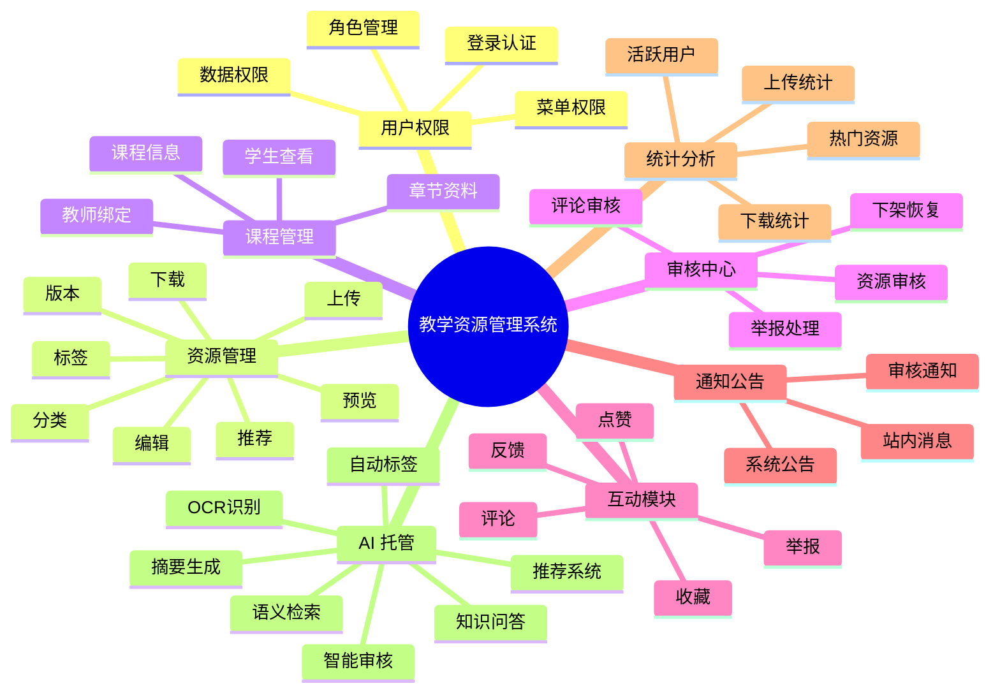
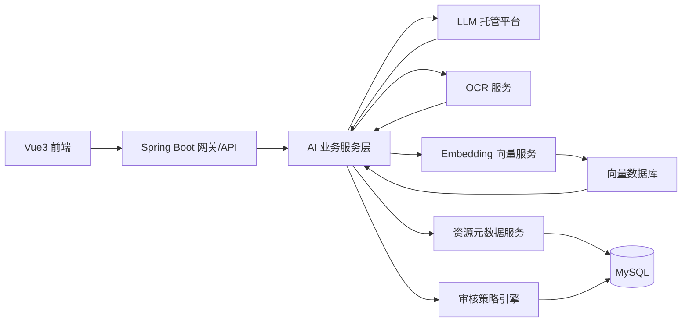
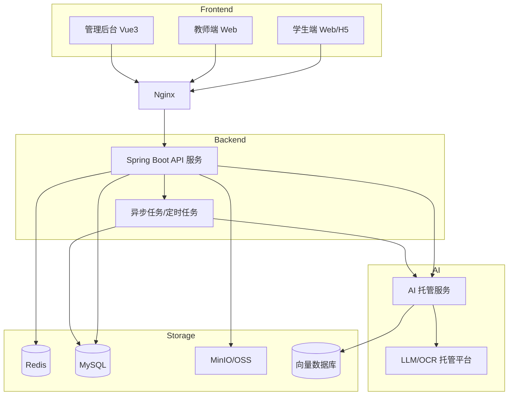
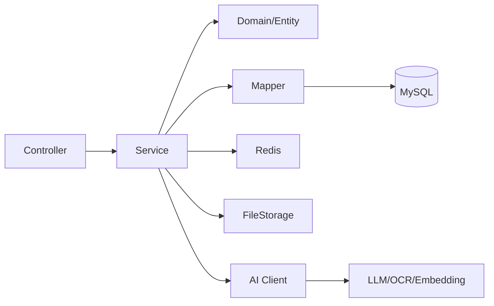

# 教学资源管理系统详细开发文档（Spring Boot + Vue 3 + AI 托管版）

- 文档版本：v1.0
- 生成时间：2026-03-23 13:37:40
- 技术方向：Spring Boot 3 + Vue 3 + MySQL + Redis + MinIO + AI 托管服务
- 文档用途：产品规划、架构设计、数据库设计、实体类设计、二次开发、项目实施

---

# 1. 项目概述

## 1.1 项目名称

**教学资源管理系统**

## 1.2 项目定位

本系统面向学校、培训机构、教研团队、教师和学生，提供一个完整的教学资源上传、审核、分类、检索、推荐、共享与运营管理平台。

系统不仅支持传统教学资源管理，还引入 **AI 托管能力**，用于：

- 资源自动分类
- 资源标签生成
- OCR 文档识别
- 资源摘要生成
- 敏感内容辅助审核
- 智能推荐
- 语义搜索
- 教学问答知识库

## 1.3 项目目标

构建一个：

- 可运营
- 可扩展
- 可私有化部署
- 可对接 AI 托管能力
- 适合二次开发
- 支持后台、教师端、学生端统一管理

的完整教学资源管理平台。

---

# 2. 技术栈设计

## 2.1 后端技术栈

- Java 17
- Spring Boot 3.x
- Spring Security 6
- JWT
- MyBatis-Plus
- MySQL 8.x
- Redis 7
- MinIO / 阿里云 OSS / 腾讯云 COS
- Knife4j / Swagger OpenAPI
- Lombok
- Hutool
- MapStruct
- Maven

## 2.2 前端技术栈

- Vue 3
- Vite
- TypeScript
- Pinia
- Vue Router
- Axios
- Element Plus
- ECharts
- UnoCSS / Tailwind（可选）

## 2.3 AI 托管相关技术栈

推荐两种模式：

### 模式 A：云端 AI 托管
适合快速上线。

- 阿里云百炼 / 通义千问
- 腾讯云混元 / 腾讯云智能体托管
- 百度千帆
- OpenAI / Azure OpenAI
- 火山引擎方舟

### 模式 B：私有化 AI 托管
适合学校内网或数据敏感场景。

- Ollama
- vLLM
- OneAPI / New API 网关
- Qwen 本地化部署
- DeepSeek 私有部署
- BGE / m3e 向量模型
- Milvus / pgvector / Elasticsearch 向量检索

## 2.4 部署技术

- Linux
- Nginx
- Docker / Docker Compose（推荐）
- 宝塔面板（可选）
- JVM 服务部署
- MySQL + Redis + MinIO 独立部署

---

# 3. 系统角色设计

## 3.1 角色定义

### 1）超级管理员 SUPER_ADMIN
拥有全平台最高权限。

### 2）平台管理员 ADMIN
负责资源、用户、课程、公告、审核管理。

### 3）审核员 AUDITOR
负责资源审核、评论审核、举报处理。

### 4）教师 TEACHER
负责上传课程资料、维护课程内容、查看教学资源数据。

### 5）学生 STUDENT
负责浏览、搜索、下载、收藏、评论、反馈。

---

# 4. 功能模块全景



---

# 5. 业务模块详细设计

## 5.1 用户与权限模块

### 功能范围
- 用户注册
- 登录/退出
- JWT 鉴权
- 角色管理
- 权限管理
- 菜单管理
- 用户状态启停
- 重置密码
- 用户资料维护
- 教师/学生身份区分
- 数据权限隔离

### 核心规则
- 超级管理员可操作全部数据
- 教师默认只能管理自己上传的资源和自己名下课程
- 学生只能访问公开资源或授权资源
- 审核员只能处理审核相关业务

---

## 5.2 教学资源模块

### 资源类型支持
- PDF
- Word
- Excel
- PPT
- 图片
- 视频
- 音频
- 压缩包
- 外部链接
- 题库文件
- 教案
- 教学大纲
- 实验指导书

### 功能点
- 上传资源
- 编辑资源信息
- 删除资源
- 提交审核
- 审核通过/驳回
- 资源下架/恢复
- 资源预览
- 资源下载
- 资源封面图
- 资源版本记录
- 资源热度统计
- 推荐位设置

---

## 5.3 分类与标签模块

### 分类建议
- 学段分类：小学 / 初中 / 高中 / 大学 / 职教
- 学科分类：语文 / 数学 / 英语 / 物理 / 化学 / 计算机 ...
- 资源类型分类：课件 / 试卷 / 教案 / 视频 / 题库 / 实验资料

### 标签建议
- 期中复习
- 期末冲刺
- 高数
- 数据结构
- 英语四级
- 教师推荐
- 精品资源
- 最新上传

---

## 5.4 课程管理模块

### 功能点
- 课程新增/编辑/删除
- 课程简介维护
- 课程教师绑定
- 课程章节维护
- 课程资源关联
- 课程公告
- 课程资料专区
- 学生课程资源浏览

---

## 5.5 审核中心模块

### 审核对象
- 教学资源
- 评论内容
- 举报信息
- 用户上传图片/头像

### 审核动作
- 待审核
- 通过
- 驳回
- 下架
- 恢复
- 加入推荐
- 标记风险

---

## 5.6 搜索模块

### 基础搜索
- 标题搜索
- 简介搜索
- 标签搜索
- 分类搜索
- 课程搜索
- 上传人搜索

### 高级搜索
- 资源类型筛选
- 审核状态筛选
- 时间范围筛选
- 热度排序
- 下载量排序
- 收藏量排序

### AI 语义搜索
- 按意思搜索
- 问题式搜索
- 相似资源推荐

---

## 5.7 空间管理与分享模块

### 模块定位

空间管理模块用于把教学资源平台进一步升级为“教学资料网盘中心”，支持：

- 教师个人空间
- 学生学习空间
- 审核资料暂存空间
- 平台公共模板空间
- 文件夹 / 文件分享
- 密码分享
- 指定授权分享
- 上传大小限制
- 可用空间限制
- 账号封禁联动控制

### 核心能力

#### 1）空间配额控制

- 每个账号单独设置可用空间（GB）
- 每个账号单独设置单文件上传限制（MB）
- 支持记录已用空间
- 支持是否允许分享
- 支持是否允许密码分享
- 支持最大分享天数

#### 2）空间策略控制

- 全局文件上传限制
- 视频上传限制
- 设计类文件上传限制
- 教师默认空间策略
- 学生默认空间策略
- 默认分享有效期
- 最大分享有效期
- 回收站保留天数
- 空间预警阈值
- 教师/学生分享总开关

#### 3）空间分享控制

- 分享对象类型：文件 / 文件夹
- 分享方式：公开链接 / 密码分享 / 指定授权
- 可设置访问期限
- 可设置下载次数限制
- 记录访问次数与下载次数
- 支持管理员停用分享

#### 4）账号封禁联动

- 账号封禁仍以 `sys_user.status` 为准
- 空间配额页同步维护账号状态
- 可记录封禁原因
- 被封禁账号不可登录，不可上传，不可分享

### 当前已落库的数据表

- `edu_user_quota`：空间配额
- `edu_global_config`：空间策略
- `edu_teacher_student_grant`：课程资源授权
- `edu_space_share`：空间分享

### 当前已配置的菜单

- 资源授权
- 空间分享
- 空间配额
- 空间策略

---

## 5.7 互动模块

### 功能点
- 收藏资源
- 点赞资源
- 评论资源
- 评论回复
- 举报评论
- 举报资源
- 意见反馈

---

## 5.8 公告通知模块

### 功能点
- 系统公告
- 课程公告
- 审核通知
- 举报处理通知
- 下载权限变化通知
- 站内消息中心

---

## 5.9 数据统计模块

### 统计项
- 每日资源上传量
- 每日下载量
- 热门课程
- 热门资源
- 用户活跃度
- 教师上传排行
- 分类资源分布
- 审核通过率
- 举报处理率

---

# 6. AI 托管设计（重点增强版）

## 6.1 AI 托管目标

系统引入 AI 托管，不是单纯聊天，而是直接服务核心业务。

## 6.2 AI 能力清单

### 1）资源上传智能分类
资源上传后，AI 根据标题、简介、正文内容自动判断：
- 学科
- 年级
- 资源类型
- 适用课程

### 2）自动标签生成
例如：
- 高等数学
- 线性代数
- 期末复习
- 章节习题
- 大学物理实验

### 3）OCR 文档识别
针对 PDF、扫描图片、拍照文档：
- 提取标题
- 提取目录
- 提取关键内容
- 生成索引

### 4）资源摘要生成
自动生成：
- 资源概述
- 适用对象
- 重点章节
- 教学用途说明

### 5）智能审核辅助
辅助识别：
- 低质量资源
- 重复资源
- 敏感违规内容
- 广告/引流内容
- 版权风险提示

### 6）资源相似度检测
防止重复上传。

### 7）语义搜索
用户输入：
- “有没有高数期末复习题”
- “大学物理实验指导书”
- “适合大一新生看的计算机基础 PPT”

系统能返回语义相关资源。

### 8）AI 教学问答
基于资源库构建知识问答：
- 回答课程相关问题
- 推荐相关资料
- 给出资料出处

---

## 6.3 AI 托管服务分层



---

## 6.4 AI 托管模块拆分建议

### ai_task 表
用于记录异步 AI 任务。

### ai_prompt_template 表
用于维护提示词模板。

### ai_audit_result 表
用于保存 AI 审核建议。

### ai_embedding_index 表
用于向量索引记录。

### ai_qa_log 表
用于记录问答日志。

---

## 6.5 AI 调用时机设计

### 上传资源后触发
- 自动摘要
- 自动标签
- 自动分类
- OCR 抽取
- 相似度检测

### 审核前触发
- 内容合规建议
- 风险评分
- 疑似重复检测

### 搜索时触发
- 关键词增强
- 语义召回
- 相似资源推荐

### 问答时触发
- RAG 检索增强回答
- 课程知识问答

---

## 6.6 AI 托管接口建议

### `/api/ai/resource/summary`
生成资源摘要

### `/api/ai/resource/tags`
生成资源标签

### `/api/ai/resource/classify`
智能分类

### `/api/ai/resource/audit`
AI 辅助审核

### `/api/ai/resource/similarity`
相似度比对

### `/api/ai/search/semantic`
语义搜索

### `/api/ai/qa/ask`
知识问答

---

## 6.7 AI 托管落地建议

### 方案一：最省事
- 大模型 SaaS
- OCR SaaS
- ES 或 pgvector

### 方案二：学校私有化
- Spring Boot + AI 中台服务
- Ollama / vLLM
- MinIO
- PostgreSQL + pgvector / Milvus
- 私有知识库

---

# 7. 系统架构图



---

# 8. 后端分层架构



---

# 9. 数据库 ER 图

```mermaid
erDiagram
    SYS_USER ||--o{ SYS_USER_ROLE : has
    SYS_ROLE ||--o{ SYS_USER_ROLE : has
    SYS_ROLE ||--o{ SYS_ROLE_MENU : grants
    SYS_MENU ||--o{ SYS_ROLE_MENU : assigned

    SYS_USER ||--o{ EDU_RESOURCE : uploads
    EDU_CATEGORY ||--o{ EDU_RESOURCE : classifies
    EDU_COURSE ||--o{ EDU_RESOURCE : belongs
    EDU_RESOURCE ||--o{ EDU_RESOURCE_TAG : linked
    EDU_TAG ||--o{ EDU_RESOURCE_TAG : linked

    SYS_USER ||--o{ EDU_COMMENT : writes
    EDU_RESOURCE ||--o{ EDU_COMMENT : owns
    SYS_USER ||--o{ EDU_FAVORITE : collects
    EDU_RESOURCE ||--o{ EDU_FAVORITE : collected
    SYS_USER ||--o{ EDU_DOWNLOAD_LOG : downloads
    EDU_RESOURCE ||--o{ EDU_DOWNLOAD_LOG : downloaded

    SYS_USER ||--o{ EDU_REPORT : reports
    SYS_USER ||--o{ SYS_FEEDBACK : submits
    SYS_USER ||--o{ SYS_NOTICE : publishes
    SYS_USER ||--o{ EDU_AUDIT_RECORD : reviews

    EDU_RESOURCE ||--o{ EDU_AUDIT_RECORD : audited
    EDU_RESOURCE ||--o{ AI_AUDIT_RESULT : analyzed
    EDU_RESOURCE ||--o{ AI_EMBEDDING_INDEX : vectorized
    EDU_RESOURCE ||--o{ AI_TASK : triggers
    SYS_USER ||--o{ AI_QA_LOG : asks

    SYS_USER {
      bigint id PK
      varchar username
      varchar password
      varchar nickname
      varchar role_type
      tinyint status
    }

    SYS_ROLE {
      bigint id PK
      varchar role_name
      varchar role_code
      tinyint status
    }

    SYS_MENU {
      bigint id PK
      bigint parent_id
      varchar menu_name
      varchar permission_code
      varchar path
    }

    EDU_RESOURCE {
      bigint id PK
      varchar title
      varchar resource_type
      bigint category_id
      bigint course_id
      bigint uploader_id
      varchar audit_status
      varchar file_url
    }

    EDU_CATEGORY {
      bigint id PK
      bigint parent_id
      varchar name
      tinyint status
    }

    EDU_TAG {
      bigint id PK
      varchar tag_name
      varchar color
    }

    EDU_COURSE {
      bigint id PK
      varchar course_name
      bigint teacher_id
      varchar semester
    }

    EDU_COMMENT {
      bigint id PK
      bigint resource_id
      bigint user_id
      bigint parent_id
      text content
    }

    EDU_FAVORITE {
      bigint id PK
      bigint user_id
      bigint resource_id
    }

    EDU_DOWNLOAD_LOG {
      bigint id PK
      bigint user_id
      bigint resource_id
      datetime created_at
    }

    EDU_AUDIT_RECORD {
      bigint id PK
      varchar target_type
      bigint target_id
      bigint reviewer_id
      varchar status
    }

    EDU_REPORT {
      bigint id PK
      varchar report_type
      bigint target_id
      bigint reporter_id
      varchar status
    }

    SYS_NOTICE {
      bigint id PK
      varchar title
      bigint publisher_id
      tinyint status
    }

    SYS_FEEDBACK {
      bigint id PK
      bigint user_id
      varchar title
      varchar status
    }

    AI_TASK {
      bigint id PK
      varchar task_type
      bigint target_id
      varchar status
    }

    AI_AUDIT_RESULT {
      bigint id PK
      bigint resource_id
      varchar risk_level
      text suggestion
    }

    AI_EMBEDDING_INDEX {
      bigint id PK
      bigint resource_id
      varchar vector_key
    }

    AI_QA_LOG {
      bigint id PK
      bigint user_id
      text question
      text answer
    }
```



---

# 10. 数据库表设计总览

## 10.1 权限基础表
- sys_user
- sys_role
- sys_menu
- sys_user_role
- sys_role_menu
- sys_operate_log

## 10.2 教学业务表
- edu_resource
- edu_category
- edu_tag
- edu_resource_tag
- edu_course
- edu_course_chapter
- edu_comment
- edu_favorite
- edu_download_log
- edu_audit_record
- edu_report
- sys_notice
- sys_feedback

## 10.3 AI 托管表
- ai_task
- ai_prompt_template
- ai_audit_result
- ai_embedding_index
- ai_qa_log

---

# 11. 详细实体类设计

下面给出建议实体类结构，适合直接映射 MyBatis-Plus。

## 11.1 BaseEntity

```java
package com.example.edu.common.entity;

import com.baomidou.mybatisplus.annotation.FieldFill;
import com.baomidou.mybatisplus.annotation.TableField;
import lombok.Data;

import java.time.LocalDateTime;

@Data
public class BaseEntity {
    @TableField(fill = FieldFill.INSERT)
    private LocalDateTime createdAt;

    @TableField(fill = FieldFill.INSERT_UPDATE)
    private LocalDateTime updatedAt;

    private Integer deleted;
}
```

## 11.2 用户实体 SysUser

```java
package com.example.edu.modules.user.entity;

import com.baomidou.mybatisplus.annotation.IdType;
import com.baomidou.mybatisplus.annotation.TableId;
import com.baomidou.mybatisplus.annotation.TableName;
import com.example.edu.common.entity.BaseEntity;
import lombok.Data;

@Data
@TableName("sys_user")
public class SysUser extends BaseEntity {
    @TableId(type = IdType.ASSIGN_ID)
    private Long id;
    private String username;
    private String password;
    private String nickname;
    private String avatar;
    private String email;
    private String phone;
    private Integer gender;
    private String roleType;
    private Integer status;
    private String schoolName;
    private String collegeName;
    private String majorName;
    private String className;
    private String remark;
}
```

## 11.3 角色实体 SysRole

```java
@Data
@TableName("sys_role")
public class SysRole extends BaseEntity {
    @TableId(type = IdType.ASSIGN_ID)
    private Long id;
    private String roleName;
    private String roleCode;
    private String remark;
    private Integer status;
}
```

## 11.4 菜单实体 SysMenu

```java
@Data
@TableName("sys_menu")
public class SysMenu extends BaseEntity {
    @TableId(type = IdType.ASSIGN_ID)
    private Long id;
    private Long parentId;
    private String menuName;
    private Integer menuType;
    private String path;
    private String component;
    private String permissionCode;
    private String icon;
    private Integer sort;
    private Integer visible;
    private Integer status;
}
```

## 11.5 课程实体 EduCourse

```java
@Data
@TableName("edu_course")
public class EduCourse extends BaseEntity {
    @TableId(type = IdType.ASSIGN_ID)
    private Long id;
    private String courseName;
    private String courseCode;
    private Long teacherId;
    private String teacherName;
    private String semester;
    private String coverUrl;
    private String description;
    private Integer status;
}
```

## 11.6 分类实体 EduCategory

```java
@Data
@TableName("edu_category")
public class EduCategory extends BaseEntity {
    @TableId(type = IdType.ASSIGN_ID)
    private Long id;
    private Long parentId;
    private String name;
    private Integer level;
    private Integer sort;
    private Integer status;
}
```

## 11.7 标签实体 EduTag

```java
@Data
@TableName("edu_tag")
public class EduTag extends BaseEntity {
    @TableId(type = IdType.ASSIGN_ID)
    private Long id;
    private String tagName;
    private String color;
    private Integer status;
}
```

## 11.8 资源实体 EduResource

```java
@Data
@TableName("edu_resource")
public class EduResource extends BaseEntity {
    @TableId(type = IdType.ASSIGN_ID)
    private Long id;
    private String title;
    private String description;
    private String coverUrl;
    private String fileName;
    private String fileUrl;
    private Long fileSize;
    private String fileType;
    private String resourceType;
    private Long categoryId;
    private Long courseId;
    private Long uploaderId;
    private String uploaderName;
    private String auditStatus;
    private String auditRemark;
    private Integer isRecommend;
    private Integer isPublic;
    private Integer viewCount;
    private Integer downloadCount;
    private Integer collectCount;
    private Integer likeCount;
}
```

## 11.9 资源标签关联实体 EduResourceTag

```java
@Data
@TableName("edu_resource_tag")
public class EduResourceTag {
    @TableId(type = IdType.ASSIGN_ID)
    private Long id;
    private Long resourceId;
    private Long tagId;
}
```

## 11.10 评论实体 EduComment

```java
@Data
@TableName("edu_comment")
public class EduComment extends BaseEntity {
    @TableId(type = IdType.ASSIGN_ID)
    private Long id;
    private Long resourceId;
    private Long userId;
    private Long parentId;
    private String content;
    private Integer status;
}
```

## 11.11 收藏实体 EduFavorite

```java
@Data
@TableName("edu_favorite")
public class EduFavorite extends BaseEntity {
    @TableId(type = IdType.ASSIGN_ID)
    private Long id;
    private Long userId;
    private Long resourceId;
}
```

## 11.12 下载日志实体 EduDownloadLog

```java
@Data
@TableName("edu_download_log")
public class EduDownloadLog extends BaseEntity {
    @TableId(type = IdType.ASSIGN_ID)
    private Long id;
    private Long userId;
    private Long resourceId;
    private String ip;
    private String userAgent;
}
```

## 11.13 审核记录实体 EduAuditRecord

```java
@Data
@TableName("edu_audit_record")
public class EduAuditRecord extends BaseEntity {
    @TableId(type = IdType.ASSIGN_ID)
    private Long id;
    private String targetType;
    private Long targetId;
    private String status;
    private Long reviewerId;
    private String remark;
}
```

## 11.14 举报实体 EduReport

```java
@Data
@TableName("edu_report")
public class EduReport extends BaseEntity {
    @TableId(type = IdType.ASSIGN_ID)
    private Long id;
    private String reportType;
    private Long targetId;
    private Long reporterId;
    private String reason;
    private String description;
    private String status;
    private String result;
}
```

## 11.15 公告实体 SysNotice

```java
@Data
@TableName("sys_notice")
public class SysNotice extends BaseEntity {
    @TableId(type = IdType.ASSIGN_ID)
    private Long id;
    private String title;
    private String content;
    private Long publisherId;
    private Integer status;
    private Integer isTop;
}
```

## 11.16 用户反馈实体 SysFeedback

```java
@Data
@TableName("sys_feedback")
public class SysFeedback extends BaseEntity {
    @TableId(type = IdType.ASSIGN_ID)
    private Long id;
    private Long userId;
    private String title;
    private String content;
    private String contact;
    private String status;
    private String replyContent;
}
```

## 11.17 AI 任务实体 AiTask

```java
@Data
@TableName("ai_task")
public class AiTask extends BaseEntity {
    @TableId(type = IdType.ASSIGN_ID)
    private Long id;
    private String taskType;
    private Long targetId;
    private String targetType;
    private String requestPayload;
    private String responsePayload;
    private String status;
    private Integer retryCount;
    private String errorMessage;
}
```

## 11.18 AI 审核结果实体 AiAuditResult

```java
@Data
@TableName("ai_audit_result")
public class AiAuditResult extends BaseEntity {
    @TableId(type = IdType.ASSIGN_ID)
    private Long id;
    private Long resourceId;
    private String riskLevel;
    private String riskType;
    private String suggestion;
    private String modelName;
    private BigDecimal confidenceScore;
}
```

## 11.19 AI 向量索引实体 AiEmbeddingIndex

```java
@Data
@TableName("ai_embedding_index")
public class AiEmbeddingIndex extends BaseEntity {
    @TableId(type = IdType.ASSIGN_ID)
    private Long id;
    private Long resourceId;
    private String vectorKey;
    private String embeddingModel;
    private Integer chunkCount;
    private String indexStatus;
}
```

## 11.20 AI 问答日志实体 AiQaLog

```java
@Data
@TableName("ai_qa_log")
public class AiQaLog extends BaseEntity {
    @TableId(type = IdType.ASSIGN_ID)
    private Long id;
    private Long userId;
    private String question;
    private String answer;
    private String referenceIds;
    private String modelName;
    private Long costMs;
}
```

---

# 12. 推荐数据库字段设计（核心表示例）

## 12.1 sys_user

| 字段 | 类型 | 说明 |
|---|---|---|
| id | bigint | 主键 |
| username | varchar(64) | 用户名 |
| password | varchar(255) | 密码 |
| nickname | varchar(64) | 昵称 |
| avatar | varchar(255) | 头像 |
| email | varchar(128) | 邮箱 |
| phone | varchar(32) | 手机号 |
| role_type | varchar(32) | 角色类型 |
| status | tinyint | 状态 |
| school_name | varchar(128) | 学校 |
| college_name | varchar(128) | 学院 |
| major_name | varchar(128) | 专业 |
| class_name | varchar(128) | 班级 |
| created_at | datetime | 创建时间 |
| updated_at | datetime | 更新时间 |
| deleted | tinyint | 逻辑删除 |

## 12.2 edu_resource

| 字段 | 类型 | 说明 |
|---|---|---|
| id | bigint | 主键 |
| title | varchar(255) | 标题 |
| description | text | 简介 |
| cover_url | varchar(255) | 封面 |
| file_name | varchar(255) | 文件名 |
| file_url | varchar(500) | 文件地址 |
| file_size | bigint | 文件大小 |
| file_type | varchar(64) | 文件类型 |
| resource_type | varchar(64) | 资源类型 |
| category_id | bigint | 分类 |
| course_id | bigint | 课程 |
| uploader_id | bigint | 上传人 |
| audit_status | varchar(32) | 审核状态 |
| audit_remark | varchar(500) | 审核备注 |
| is_recommend | tinyint | 是否推荐 |
| is_public | tinyint | 是否公开 |
| view_count | int | 浏览量 |
| download_count | int | 下载量 |
| collect_count | int | 收藏量 |
| like_count | int | 点赞量 |
| created_at | datetime | 创建时间 |
| updated_at | datetime | 更新时间 |
| deleted | tinyint | 逻辑删除 |

---

# 13. 接口模块建议

## 13.1 认证接口
- POST /api/auth/login
- POST /api/auth/logout
- GET /api/auth/profile
- POST /api/auth/reset-password

## 13.2 用户接口
- GET /api/user/page
- POST /api/user/create
- PUT /api/user/update
- PUT /api/user/status
- DELETE /api/user/delete/{id}

## 13.3 资源接口
- GET /api/resource/page
- GET /api/resource/detail/{id}
- POST /api/resource/upload
- POST /api/resource/create
- PUT /api/resource/update
- DELETE /api/resource/delete/{id}
- POST /api/resource/submit-audit/{id}
- POST /api/resource/recommend/{id}

## 13.4 分类标签接口
- GET /api/category/tree
- POST /api/category/create
- PUT /api/category/update
- DELETE /api/category/delete/{id}
- GET /api/tag/page
- POST /api/tag/create

## 13.5 课程接口
- GET /api/course/page
- POST /api/course/create
- PUT /api/course/update
- DELETE /api/course/delete/{id}
- GET /api/course/resource/list/{courseId}

## 13.6 审核接口
- GET /api/audit/page
- POST /api/audit/pass
- POST /api/audit/reject
- POST /api/audit/offline

## 13.7 AI 接口
- POST /api/ai/resource/summary
- POST /api/ai/resource/classify
- POST /api/ai/resource/tags
- POST /api/ai/resource/audit
- POST /api/ai/resource/similarity
- POST /api/ai/search/semantic
- POST /api/ai/qa/ask

---

# 14. 前端页面设计建议

## 14.1 管理后台页面
- 登录页
- 控制台
- 用户管理
- 角色管理
- 菜单管理
- 资源管理
- 资源审核
- 分类管理
- 标签管理
- 课程管理
- 评论管理
- 举报管理
- 公告管理
- 反馈管理
- AI 任务管理
- AI 审核结果管理
- 数据统计分析
- 系统设置

## 14.2 教师端页面
- 首页
- 我的课程
- 我的资源
- 上传资源
- 审核状态
- 课程公告
- 数据统计

## 14.3 学生端页面
- 首页
- 资源列表
- 资源详情
- 搜索页
- 我的收藏
- 我的下载
- 课程专区
- 个人中心
- 留言反馈

---

# 15. 项目目录结构建议

## 15.1 后端目录

```text
teaching-resource-server/
├─ src/main/java/com/example/edu
│  ├─ common
│  │  ├─ config
│  │  ├─ constant
│  │  ├─ exception
│  │  ├─ result
│  │  ├─ security
│  │  └─ utils
│  ├─ modules
│  │  ├─ auth
│  │  ├─ user
│  │  ├─ role
│  │  ├─ menu
│  │  ├─ course
│  │  ├─ category
│  │  ├─ tag
│  │  ├─ resource
│  │  ├─ audit
│  │  ├─ comment
│  │  ├─ favorite
│  │  ├─ notice
│  │  ├─ report
│  │  ├─ feedback
│  │  ├─ statistics
│  │  └─ ai
│  └─ EduApplication.java
├─ src/main/resources
│  ├─ mapper
│  ├─ application.yml
│  ├─ application-dev.yml
│  └─ application-prod.yml
└─ pom.xml
```

## 15.2 前端目录

```text
teaching-resource-admin/
├─ src
│  ├─ api
│  ├─ assets
│  ├─ components
│  ├─ layout
│  ├─ router
│  ├─ store
│  ├─ utils
│  ├─ hooks
│  ├─ views
│  │  ├─ login
│  │  ├─ dashboard
│  │  ├─ user
│  │  ├─ role
│  │  ├─ menu
│  │  ├─ resource
│  │  ├─ course
│  │  ├─ category
│  │  ├─ tag
│  │  ├─ audit
│  │  ├─ report
│  │  ├─ feedback
│  │  ├─ notice
│  │  ├─ statistics
│  │  └─ ai
│  ├─ App.vue
│  └─ main.ts
└─ package.json
```

---

# 16. 安全设计

## 16.1 认证安全
- JWT 登录态
- Refresh Token（可扩展）
- Redis 黑名单退出机制

## 16.2 数据安全
- 数据权限控制
- 逻辑删除
- 敏感接口操作日志
- 文件下载权限校验

## 16.3 上传安全
- 文件大小限制
- 后缀白名单
- MIME 校验
- 病毒扫描接口预留
- 敏感内容 AI 辅助审核

## 16.4 AI 安全
- 提示词模板隔离
- 输出长度限制
- 审核结果仅作辅助，最终人工确认
- 问答内容带出处引用

---

# 17. 开发阶段建议

## 第一阶段：基础框架
- Spring Boot + Vue3 初始化
- 登录认证
- 权限体系
- 用户/角色/菜单

## 第二阶段：核心业务
- 分类/标签
- 课程管理
- 资源管理
- 文件上传下载
- 审核流程

## 第三阶段：运营模块
- 公告
- 评论
- 举报
- 反馈
- 统计分析

## 第四阶段：AI 托管增强
- OCR
- 自动标签
- 摘要生成
- 辅助审核
- 语义搜索
- 问答系统

---

# 18. MVP 最小可用版本建议

如果先做第一版，建议最先完成：

1. 登录/权限
2. 用户管理
3. 分类/标签管理
4. 课程管理
5. 资源上传/列表/详情/下载
6. 资源审核
7. 公告管理
8. 基础统计

AI 托管放在第二期上线：
- 自动标签
- 自动摘要
- OCR
- AI 审核建议

---

# 19. 二次开发建议

## 19.1 适合扩展的方向
- 在线预览 PDF / Office
- 资源积分下载
- 会员付费
- 教师教学数据中心
- 在线考试
- 作业系统
- 班级管理
- 知识图谱
- AI 教学助手

## 19.2 二开注意事项
- 统一返回结构不要乱改
- 先抽公共 BaseEntity / BaseVO / BaseQuery
- 权限码统一命名
- 资源状态和审核状态要区分
- AI 结果不直接覆盖人工结果

---

# 20. 推荐最终落地方案

## 后端
- Spring Boot 3
- MyBatis-Plus
- Spring Security + JWT
- Redis
- MySQL
- MinIO

## 前端
- Vue 3 + TypeScript
- Pinia
- Vue Router
- Element Plus
- ECharts

## AI
- AI 中台独立模块
- 摘要/标签/审核/检索/问答分服务
- 支持托管模型与私有模型切换

---

# 21. 建议下一步产出

如果继续做，我建议下一步直接继续补：

1. **完整 SQL 建表文档**
2. **完整后端接口文档**
3. **完整前端页面字段清单**
4. **Spring Boot 项目脚手架目录代码**
5. **Vue3 管理后台脚手架目录代码**
6. **AI 托管模块接口与表结构详细设计**

---

# 22. 结论

这套方案不是单纯的“文件上传后台”，而是一个完整的：

- 教学资源平台
- 权限平台
- 审核平台
- 数据分析平台
- AI 托管增强平台

非常适合：
- 毕设
- 商用后台原型
- 学校内部资源平台
- 培训机构资源管理平台
- 后续二开 SaaS 化产品

---

# 23. 文件说明

本文件已包含：

- 完整系统模块说明
- AI 托管设计
- 详细实体类
- ER 图
- 系统架构图
- 开发建议
- 二开建议

后续可继续拆分为：

- `01-产品设计.md`
- `02-数据库设计.md`
- `03-接口设计.md`
- `04-前端页面设计.md`
- `05-AI托管设计.md`
- `06-部署文档.md`

